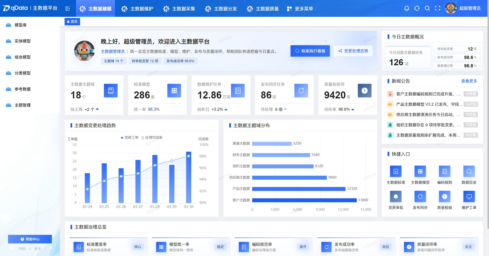
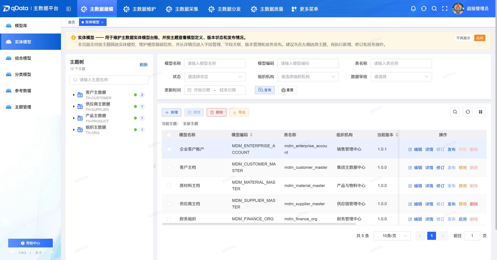
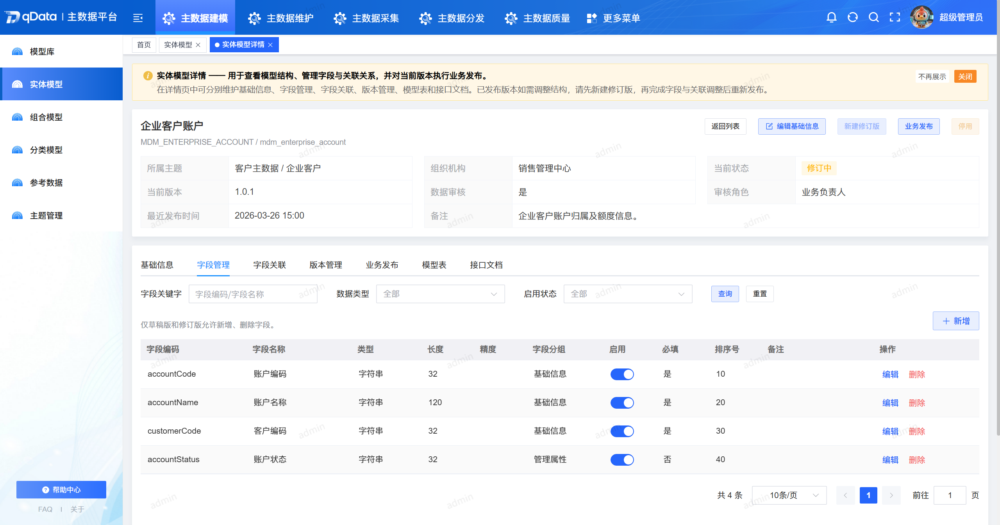
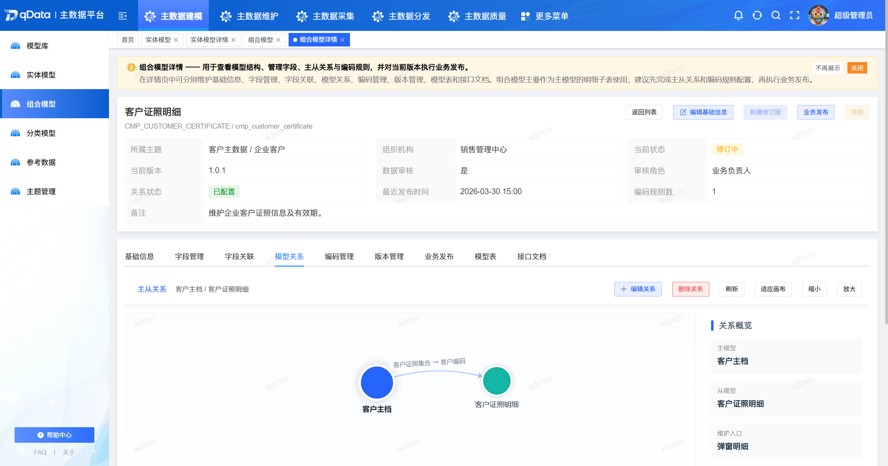
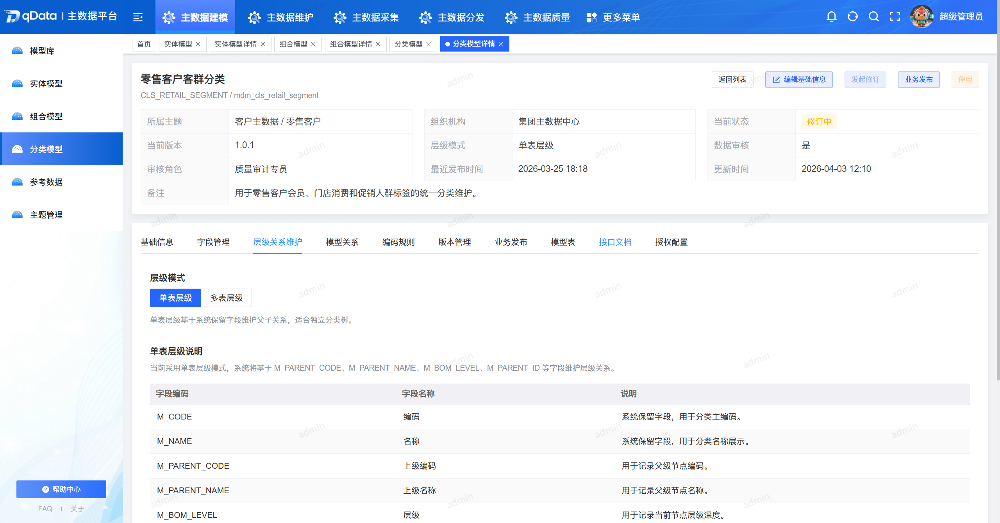
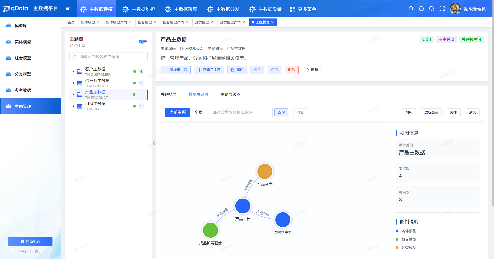

  
  
  
  
  

  
  

  📖简体中文 | <a href="README.en.md">📖English</a>

## 🌈 平台简介
**qData-mdm 主数据平台**是一套聚焦**主数据建模**、**主数据维护**、**主数据采集**、**主数据分发**与**主数据质量治理**的主数据管理平台，致力于帮助企业建立统一的主数据标准、维护流程和数据共享机制。包含系统管理、基础建模、维护、采集、分发和质量治理等功能。

✨✨✨**在线文档**✨✨✨ <a href="https://qdata.qiantong.tech" target="_blank">https://qdata.qiantong.tech</a>

<!-- ✨✨✨**开源版功能范围**✨✨✨ 包含系统管理、基础建模、维护、采集、分发与质量治理功能 -->

<!-- ✨✨✨**专业版咨询地址**✨✨✨ <a href="https://qdata.qiantong.tech/business/policy.html" target="_blank">https://qdata.qiantong.tech/business/policy.html</a> -->

> 如果 qData-mdm 对您有帮助，请点个 **Star ⭐️**，这是我们持续更新的动力！ 🚀

## 🍱 使用场景

适用于需要统一主数据标准、规范主数据维护流程、建立主数据共享机制的企业、集团与政企组织。

| 场景          | 描述                            | 典型客户类型             |
| ----------- | ----------------------------- | ------------------ |
| **主数据标准建模**  | 需要统一定义组织、客户、供应商、物料、产品等主数据模型，形成标准化的数据结构。 | 集团企业、制造企业、国企平台     |
| **主数据集中维护** | 需要建立主数据新建、变更、冻结、解冻、失效等统一维护机制，避免多系统各自维护。 | 中大型企业、共享服务中心    |
| **主数据采集同步**  | 需要从业务系统采集主数据，进行基础同步、入库和核查，形成统一主数据底座。   | 制造企业、政务平台、信息化项目 |
| **主数据分发共享** | 需要将统一主数据分发到 ERP、HR、财务、门户等下游系统，减少口径不一致问题。 | 集团企业、政企单位、行业平台  |
| **主数据质量治理** | 需要对主数据进行基础规则校验、任务执行和结果追踪，提升主数据准确性与可用性。 | 数据治理团队、信息中心、运维团队    |

## 💡 优势

| 优势点           | 描述                             |
| ------------- | ------------------------------ |
| **主数据功能覆盖完整**    | 围绕“建模、维护、采集、分发、质量”提供主数据平台基础功能，满足常见主数据管理场景。       |
| **基础能力清晰**   | 覆盖系统管理、主数据建模、维护、采集、分发和质量治理等主要模块，能力边界清晰。     |
| **建模维护一体化** | 主数据建模与主数据维护能力协同设计，便于模型定义直接服务后续维护与共享使用。     |
| **分类、实体、字典协同**  | 支持主题管理、实体模型、分类模型、数据字典等主数据基础建模能力，满足常见主数据设计场景。          |
| **采集与分发能力** | 提供基础采集任务、采集实例、手动全量分发和分发监控能力，便于打通主数据上下游链路。         |
| **质量治理能力**    | 提供基础质量规则、简单质量任务、任务实例和质量日志能力，支持常见主数据质量检查场景。   |
| **支持多种部署方式**   | 支持源码启动和 Docker 方式部署，便于不同环境下安装、联调和使用。         |

## 📋 功能清单

| 模块   | 描述                                                                                        |
|------|-------------------------------------------------------------------------------------------|
| 主题管理 | 支持模型主题目录树管理，便于按业务域组织主数据模型并统一管理模型归属。 |
| 实体模型 | 支持实体模型基础管理、字段管理、基础关联配置、版本与发布、模型表生成与基础接口能力，并支持编码规则配置。 |
| 分类模型 | 支持分类模型基础管理，内置系统保留字段与自定义字段维护能力，支持单表层级维护、版本发布、基础接口能力与编码规则。 |
| 数据字典 | 支持数据字典基础管理、字段管理、发布修订、字典数据维护及导入导出，满足通用码表统一管理需求。 |
| 主数据查询 | 支持主数据查询与明细浏览，支持分类树结构化检索，便于按层级快速定位和查看已生效数据。 |
| 主数据新建 | 支持按模型表单发起主数据新建，支持数据暂存与提交，满足日常新增场景的数据录入流程。 |
| 主数据变更 | 支持主数据修改、冻结、解冻、失效等变更操作，覆盖主数据生命周期内常见状态流转。 |
| 数据源管理 | 支持数据源基础管理、连接参数配置与连通测试，支持数据源挂载路径管理，便于统一接入采集来源。 |
| 采集任务 | 支持采集任务配置与执行，提供全量与简单增量同步能力，满足基础主数据采集与入库需求。 |
| 采集实例 | 支持按任务运行生成采集实例，记录执行过程与状态结果，便于运行跟踪与问题追溯。 |
| 采集日志 | 支持采集日志查询与运行结果查看，可用于异常定位、执行核查与日常运维分析。 |
| 应用管理 | 支持分发目标应用基础信息管理与连接可用性检测，为主数据分发链路提供目标系统台账。 |
| 分发配置 | 支持按模型配置分发任务，支持手动全量分发，可用于将主数据按需推送至下游系统。 |
| 分发监控 | 支持分发结果监控、详情查看与失败重发，帮助跟踪分发状态并形成异常处理闭环。 |
| 质量规则 | 支持基础质量规则管理，可按规则对主数据进行常规质量校验。 |
| 质量任务 | 支持简单质量任务配置与执行，用于定期或按需触发主数据质量检查。 |
| 质量任务实例 | 支持质量任务实例运行状态与结果跟踪，便于查看每次质量检查的执行情况。 |
| 质量日志 | 支持质量日志查询与异常定位，支撑质量检查过程审计与问题排查。 |

👉 qData-mdm 开源版围绕主数据场景提供能力，功能将持续迭代完善。

💡 如您有好的建议或功能需求，欢迎 [提交Issue](https://gitee.com/qiantongtech/qData/issues)，与我们共同完善主数据平台功能。

[//]: # (## 🧩 架构图)

[//]: # (![framework.png]&#40;images%2Fframework.png&#41;)

## 🛠️ 技术栈
qData-mdm 平台采用前后端分离架构，后端基于 Spring Boot，前端基于 Vue 3，并整合了主流的认证、数据库访问、缓存与前端组件能力。

<table>
  <tr>
    <th>分类</th><th>技术</th><th>描述</th>
  </tr>
  <tr>
    <td rowspan="6">后端技术栈</td><td>Spring Boot</td><td>提供快速开发能力与统一服务启动入口</td>
  </tr>
  <tr>
    <td>Spring Security</td><td>实现用户认证、授权与安全控制</td>
  </tr>
  <tr>
    <td>MySQL、达梦8</td><td>持久化存储与数据源配置管理</td>
  </tr>
  <tr>
    <td>MyBatis-Plus</td><td>简化数据库操作与多数据源访问</td>
  </tr>
  <tr>
    <td>Redis</td><td>支持缓存、登录态与基础中间件能力</td>
  </tr>
  <tr>
    <td>Knife4j / OpenAPI</td><td>提供接口文档展示与联调支持</td>
  </tr>

  <tr>
    <td rowspan="3">前端技术栈</td><td>Vue 3</td><td>现代化响应式前端框架</td>
  </tr>
  <tr>
    <td>Element Plus</td><td>常用 UI 组件支持与后台管理界面构建</td>
  </tr>
  <tr>
    <td>Vite</td><td>快速开发与构建工具</td>
  </tr>

  <tr>
    <td rowspan="4">第三方插件</td><td>AntV X6</td><td>支撑流程、图形化设计与可视化交互场景</td>
  </tr>
  <tr>
    <td>ECharts</td><td>支撑统计图表与可视化展示能力</td>
  </tr>
</table>

## 🏗️ 部署要求

在部署 qData-mdm 之前，请确保以下环境和工具已正确安装：

<table>
  <tr>
    <th>环境</th><th>项目</th><th>推荐版本</th><th>说明</th>
  </tr>
  <tr>
    <td rowspan="6">后端</td><td>JDK</td><td>1.8 或以上</td><td>建议使用 OpenJDK 8 </td>
  </tr>
  <tr>
    <td>Maven</td><td>3.6+</td><td>项目构建与依赖管理</td>
  </tr>
  <tr>
    <td>达梦8 / MySQL</td><td>8.0+</td><td>关系型数据库环境，开发配置默认偏向达梦8</td>
  </tr>
  <tr>
    <td>Redis</td><td>5.0+</td><td>缓存与登录态等基础能力支持</td>
  </tr>
  <tr>
    <td>Docker / Docker Compose</td><td>可选</td><td>用于快速体验和测试环境部署</td>
  </tr>
  <tr>
    <td>操作系统</td><td>Windows / Linux / Mac</td><td>通用环境均可运行</td>
  </tr>

  <tr>
    <td rowspan="3">前端</td><td>Node.js</td><td>16+</td><td>前端构建工具依赖</td>
  </tr>
  <tr>
    <td>npm</td><td>8+</td><td>包管理器</td>
  </tr>
  <tr>
    <td>Chrome / Edge</td><td>最新版</td><td>推荐用于本地调试与系统访问</td>
  </tr>
</table>

[//]: # (## 🚨 商用授权)

[//]: # ()
[//]: # (qData-mdm 提供 **专业版** 与 **开源版** 两种形态，满足不同规模与场景下的用户需求。开源版提供系统管理、主数据建模、维护、采集、分发和质量治理等基础功能；专业版则面向更复杂的企业级场景，提供组合模型、订阅体系、实时分发、整改处理、复杂审批与更完整的治理保障。)

[//]: # ()
[//]: # (👉 如需 **开源版品牌授权** 或 **咨询专业版**，请点击按钮查看详情：[💼 了解授权详情]&#40;https://qdata.qiantong.tech/business/policy.html&#41;)

[//]: # (## 🚀 快速开始)

[//]: # ()
[//]: # (| 部署方式                    | 说明                                                              | 适用场景               |)

[//]: # (| ----------------------- | --------------------------------------------------------------- | ------------------ |)

[//]: # (| Docker Compose 体验部署 | 通过 `docker/` 目录中的编排文件快速启动数据库、Redis、Nginx 与后端服务，适合先体验主数据平台开源版功能。 | **初学者快速上手**、功能演示、测试环境  |)

[//]: # (| 使用源代码本地启动  | 后端可通过 `mvn -pl qData-mdm-server -am spring-boot:run` 启动，前端在 `qData-mdm-ui` 下执行 `npm install` 和 `npm run dev`。  | **日常开发**、功能联调          |)

[//]: # (| 自主部署（纯手工安装）  | 根据 `application-dev.yml` / `application-prod.yml`、数据库初始化脚本和前端构建产物，手工完成部署与参数配置。 | **生产环境**、大规模部署、个性化定制场景 |)

[//]: # ()
[//]: # (👉 查看完整的安装与部署资料时，建议结合 `docker/`、`qData-mdm-server/src/main/resources/`、`sql/` 目录与官方文档一并使用。)

## 👥 QQ交流群
欢迎加入 qData 官方 QQ 交流群，获取最新动态、技术支持与使用交流。

👉 <a href="https://qdata.qiantong.tech/discuss.html">点击加入 QQ 交流群</a>

<!-- 

 -->

## 🖼️ 系统配图
<table>
  <tr>
    <td width="50%" valign="top"></td>
    <td width="50%" valign="top"></td>
  </tr>
  <tr>
    <td width="50%" valign="top"></td>
    <td width="50%" valign="top"></td>
  </tr>
  <tr>
    <td width="50%" valign="top"></td>
    <td width="50%" valign="top"></td>
  </tr>
</table>
